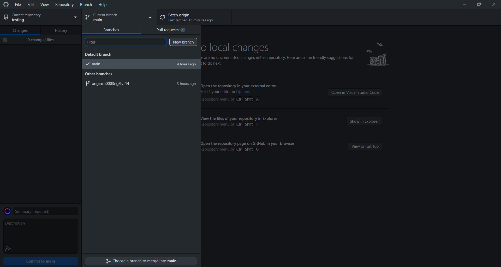
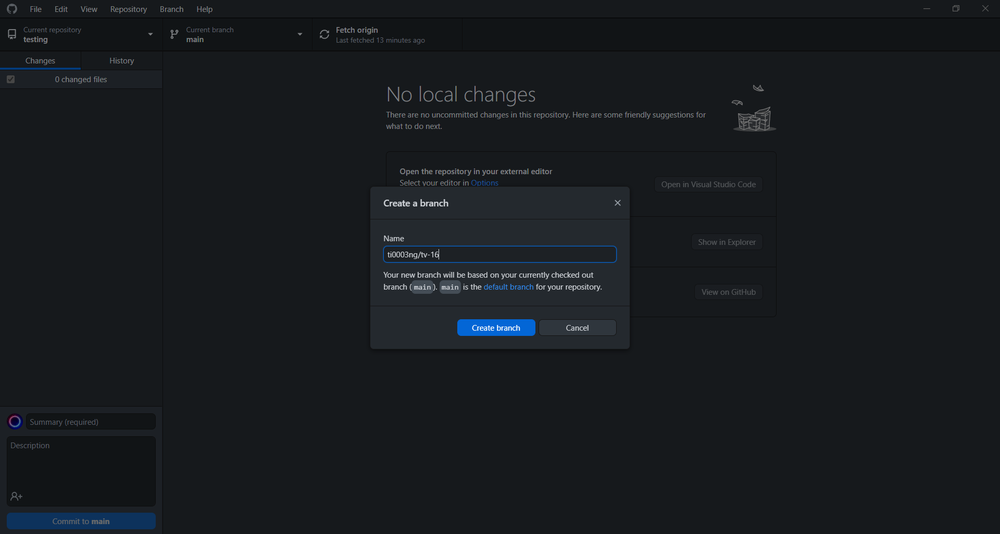
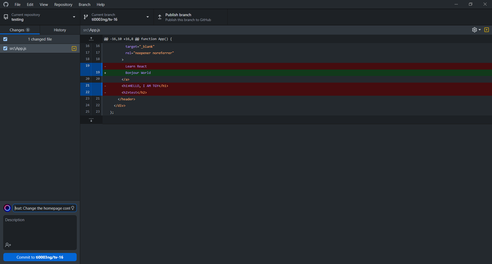
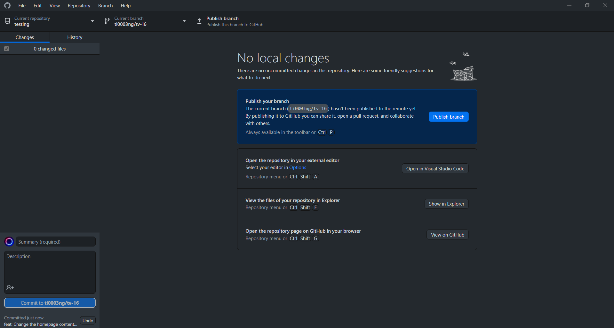
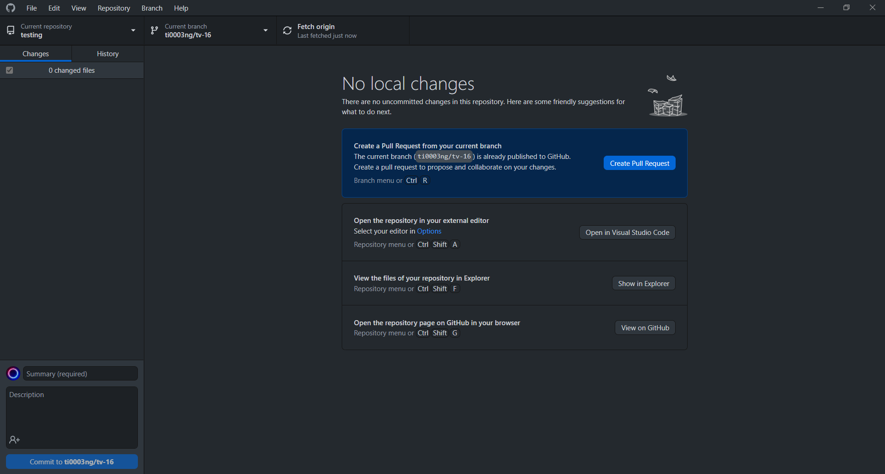

# TOP Tech Workflows

This README is intended for beginners in Linear issues and GitHub pull requests.

## Table of Contents
1. [How to create a Linear issue.](#create-issue)
2. [How to edit a Linear issue.](#edit-issue)
3. [How to write good commit messages.](#commit-message)
4. [How to link a commit to a Linear issue.](#link-commit-pr)
   1. [GitHub Method](#github-method)
   2. [GitHub Desktop](#github-desktop)
   3. [Git Method](#git-method)
5. [How to link a pull request to Linear issue.](#link-pr-linear)

## How to create a Linear issue

1. Select your team. In our example, we will select 'Test & Verify' team.

2. Select 'Issues' tab.

3. Click on the '+' button on the top right and the issue creation window will be opened.

4. Now, key in the necessary information including title, description (if any), set the status, priority, assignee, label, as well as due date.

5. After that, save the issue and voila, a Linear issue is created.

   

## How to edit a Linear issue

1. From the list of issues, select the issue that you want to edit.

   

2. You can change the title, add description, change status, priority, assignee, label, as well as due date.

## How to write good commit messages

Every time when we create a new commit, we need to input the commit title/message. In general, we will follow this guide
in writing good commit messages: [How to Write Good Commit Messages: A Practical Git Guide](https://www.freecodecamp.org/news/writing-good-commit-messages-a-practical-guide/)

## How to link a commit to a Linear issue

In order to link a commit and a pull request to a Linear issue, the general idea is to copy the branch name from Linear issue and use it as the branch name in GitHub. Then, when a pull request (PR) for that branch is opened, the title of the PR must contain the Linear issue ID.

### i. GitHub Method

You can use this method if you want to edit the files directly in GitHub repository without going into IDE or code editor.

1. In GitHub, select a file that you want to change. In our example, we will choose src -> App.js file.

2. Edit the file.

3. Copy the git branch name from the Linear issue that you want to link to. 

   

4. <code>Important</code> After you have copied the branch name, select 'Create a new branch...' and key in the copied branch name.

   

5. Enter a commit title according to the guide, which is the label followed by the title of the Linear issue. In this case, the label is 'Feature'. So, our commit title will look like this: <code>feat: Change the homepage contents to 'Hello World'</code>

   

6. Click 'Propose changes'.

7. Continue at [How to Link PR to Linear](#link-pr-linear).

### ii. GitHub Desktop

This is the preferred method for people who do not use Git to commit to GitHub repository. For this method, you need to have [GitHub Desktop](https://desktop.github.com/) and [VS Code](https://code.visualstudio.com/) installed in your computer.

1. Make sure you have cloned the repository.

2. Copy the git branch name from the Linear issue that you want to link to (Refer to [step 3](#copy-branch-name) in GitHub Method).

3. <code>Important</code> After you have copied the branch name, create a new branch using the copied branch name.

   
   

4. Click 'Open in Visual Studio Code'.

5. In VS Code, select a file that you want to change. In our example, we will choose src -> App.js file.

6. Edit and save the file.

7. Go back to GitHub Desktop, enter a commit title according to the guide, which is the label followed by the title of the Linear issue. In this case, the label is 'Feature'. So, our commit title will look like this: <code>feat: Change the homepage contents to 'Boujour World'</code>

   

8. Click 'commit to {branch name}'. Then, click 'Publish branch'.

   

9. Click 'Create Pull Request'.

   

10. Continue at [How to Link PR to Linear](#link-pr-linear).

### iii. Git Method

This is the preferred method for people who want to use Git to commit to GitHub repository. For this method, you can use any IDE or code editor you like.
In our example, we will use VS Code.

1. Make sure you have cloned the repository.

2. Copy the git branch name from the Linear issue that you want to link to (Refer to [step 3](#copy-branch-name) in GitHub Method).

3. <code>Important</code> After you have copied the branch name, create a new branch using the copied branch name with the following command: 
   Example: <code>git branch ti0003ng/tv-14</code>
   
4. After the new branch has been created, enter <code>git checkout ti0003ng/tv-14</code> to navigate to the new branch.

5. Edit and save the file in VS Code.

6. Enter <code>git add .</code> to select all files that are modified.

7. Enter <code>git status</code> to check the status of the files to be committed.

8. Enter <code>git commit -m "feat: Change the homepage contents to 'Hello World'"</code>.
   
9. Enter <code>git push origin ti0003ng/tv-14</code> to commit to the new branch.

10. Open the new branch created in GitHub repository and create a new pull request.

11. Continue at [How to Link PR to Linear](#link-pr-linear).

## How to link PR to Linear

1. Now, you have arrived on the PR creation page.

   

2. <code>Important</code> Enter the issue ID in square brackets right after the PR title. The issue ID can be found in the Linear issue. In this case, the issue ID is <code>TV-14</code>.

   

3. Click 'Create pull request' and voila, the Linear issue is automatically updated to 'In Progress' and later to 'In Review' status.

   
   

## More to be updated...

## References

Ayodeji, B. (2019, Nov 28). *How to Write Good Commit Messages: A Practical Git Guide*. https://www.freecodecamp.org/news/writing-good-commit-messages-a-practical-guide/

Linear. (n.d.). *Create issues*. https://linear.app/docs/creating-issues/.

Linear. (n.d.). *Edit issues*. https://linear.app/docs/editing-issues.

Linear. (n.d.). *GitHub*. https://linear.app/docs/github.
