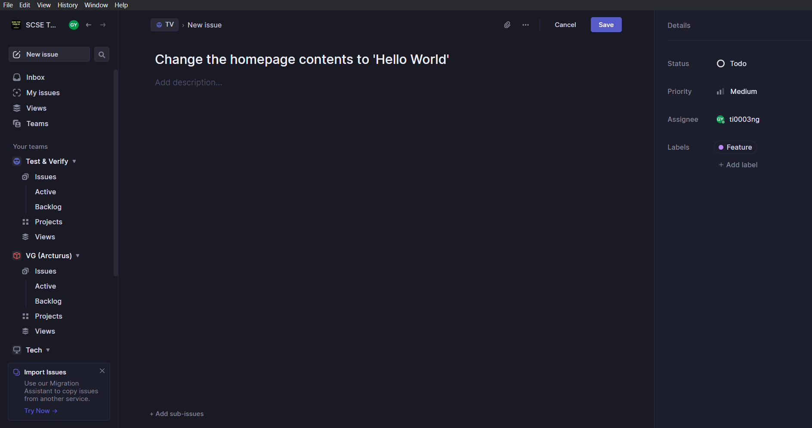
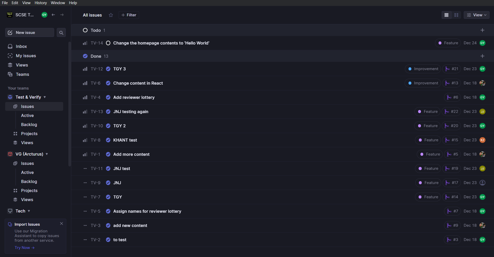
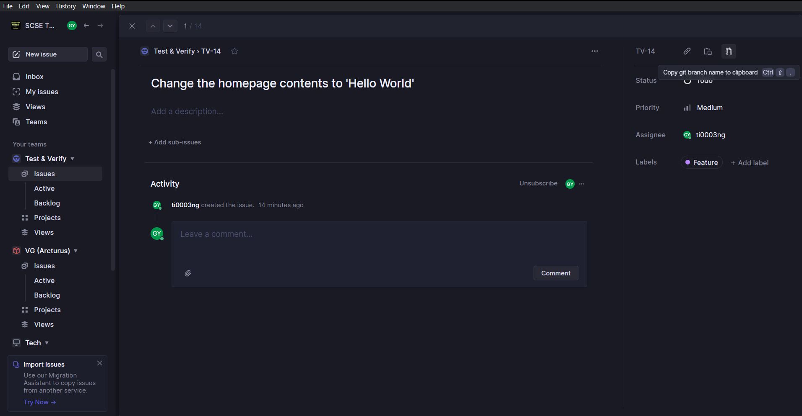
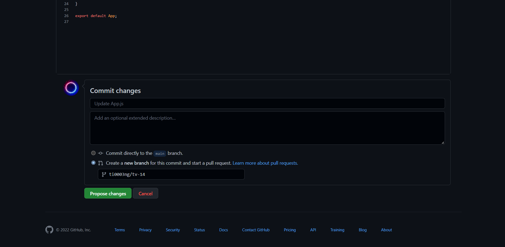
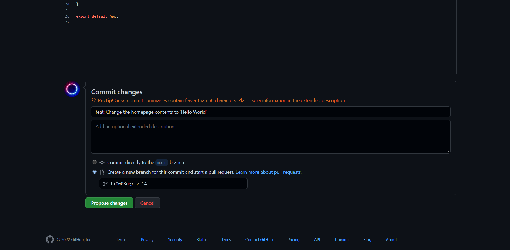
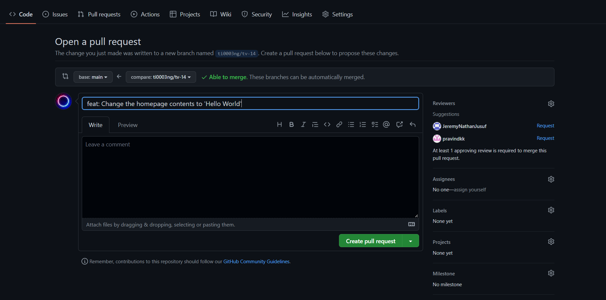
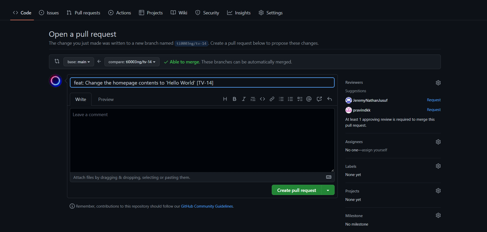
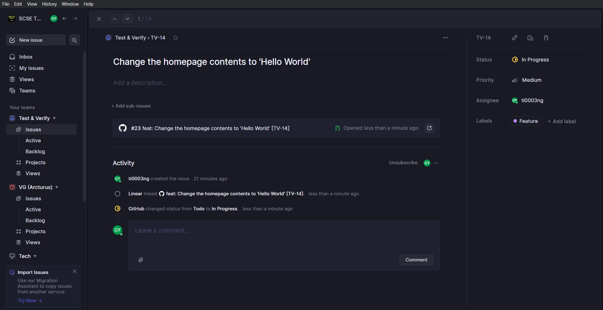
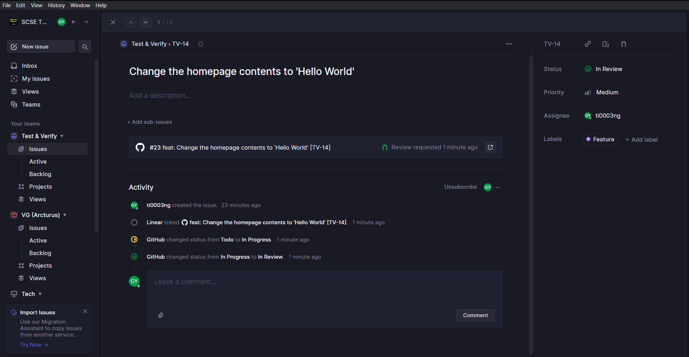

# Introduction to TOP Tech Workflows

Through this README, you will be able to understand:
1. How to create a Linear issue.
2. How to edit a Linear issue.
3. How to write good commit messages.
4. How to link a commit and a pull request to a Linear issue.

## How to create a Linear issue

1. Select your team. In our example, we will select 'Test & Verify' team.

2. Select 'Issues' tab.

3. Click on the '+' button on the top right and the issue creation window will be opened.

4. Now, key in the necessary information including title, description (if any), set the status, priority, assignee, label, as well as due date.

5. After that, we will save the issue and voila, a Linear issue is created.

   </img>

## How to edit a Linear issue

1. From the list of issues, select the issue that you want to edit.

   </img>

2. You can change the title, add description, change status, priority, assignee, label, as well as due date.

## How to write good commit messages

Every time when we create a new commit, we need to input the commit title/message. In general, we will follow this guide
in writing good commit messages: [How to Write Good Commit Messages: A Practical Git Guide](https://www.freecodecamp.org/news/writing-good-commit-messages-a-practical-guide/)

## How to link a commit and a pull request to a Linear issue

### a. GitHub methods

1. In GitHub, select a file that you want to change. In our example, we will choose src -> App.js file.

2. Edit the file.

3. Copy the git branch name from the Linear issue that you want to link to.

   </img>

4. <code>Important</code> After we have copied the branch name, select 'Create a new branch...' and key in the copied branch name.

   </img>

5. Enter a commit title according to the guide, which is the label followed by the title of the Linear issue. In this case, the label is 'Feature'. So, our commit title will look like this: <code>feat: Change the homepage contents to 'Hello World'</code>

   </img>

6. Click 'Propose changes'. You will arrive on the pull request (PR) creation page.

   </img>

7. <code>Important</code> Enter the issue ID in square brackets right after the PR title. The issue ID can be found in the Linear issue. In this case, the issue ID is <code>TV-14</code>.

   </img>

8. Click 'Create pull request' and voila, the Linear issue is automatically updated to 'In Progress' and later to 'In Review' status.

   </img>
   </img>

## More to be updated...

## References

Ayodeji, B. (2019, Nov 28). *How to Write Good Commit Messages: A Practical Git Guide*. https://www.freecodecamp.org/news/writing-good-commit-messages-a-practical-guide/

Linear. (n.d.). *Create issues*. https://linear.app/docs/creating-issues/.

Linear. (n.d.). *Edit issues*. https://linear.app/docs/editing-issues.

Linear. (n.d.). *GitHub*. https://linear.app/docs/github.
