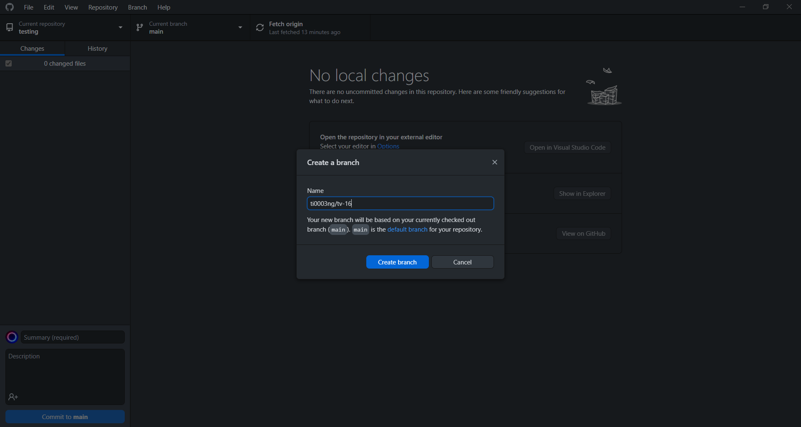

# The What and How of GitHub-Linear Workflows

This documentation introduces you to the automated workflows between GitHub commits and pull requests to Linear issues.

## Table of Contents
1. [Linking GitHub commit to a Linear issue](#link-commit-linear).
   1. [GitHub method](#github-method).
   2. [GitHub Desktop](#github-desktop).
   3. [Git method](#git-method).
2. [Linking GitHub pull request to a Linear issue](#link-pr-linear).
3. [Linking multiple PRs to a Linear issue](#link-multiple-pr).
4. [Linking a PR to multiple Linear issues](#link-multiple-linear).
5. [Reviewing a pull request](#review-pr-linear).

## Linking GitHub commit to a Linear issue 

In order to link a commit and a pull request to a Linear issue, the general idea is to copy the branch name from Linear issue and use it as the branch name in GitHub. Then, when a pull request (PR) for that branch is opened, the title of the PR must contain the Linear issue ID.

### i. GitHub method 

You can use this method if you want to edit the files directly in GitHub repository without going into IDE or code editor.
Given that you have a Linear issue as follows:
> TV-14 Change the hompage contents to 'Hello World'

1. In GitHub, select a file that you want to change. In our example, we will choose src -> App.js file.

2. Edit the file.

3. Copy the git branch name from the Linear issue that you want to link to. 

   

      
   

4. <code>Important</code> After you have copied the branch name, select 'Create a new branch...' and key in the copied branch name.

   

      
   

5. Enter a commit title according to the guide, which is the label followed by the title of the Linear issue. In this case, the label is 'Feature'. So, our commit title will look like this: <code>feat: Change the homepage contents to 'Hello World'</code>

   

      
   

6. Click 'Propose changes'.

7. Continue at [Linking GitHub PR to a Linear issue](#link-pr-linear).

### ii. GitHub Desktop 

This is the preferred method for people who do not use Git to commit to GitHub repository. For this method, you need to have [GitHub Desktop](https://desktop.github.com/) and [VS Code](https://code.visualstudio.com/) installed in your computer.
Given that you have a Linear issue as follows:
> TV-15 Change the hompage contents to 'Bonjour World'

1. Make sure you have cloned the repository.

2. Copy the git branch name from the Linear issue that you want to link to (Refer to [step 3](#copy-branch-name) in GitHub Method).

3. <code>Important</code> After you have copied the branch name, create a new branch using the copied branch name.

   

      
      
   

4. Click 'Open in Visual Studio Code'.

5. In VS Code, select a file that you want to change. In our example, we will choose src -> App.js file.

6. Edit and save the file.

7. Go back to GitHub Desktop, enter a commit title according to the guide, which is the label followed by the title of the Linear issue. In this case, the label is 'Feature'. So, our commit title will look like this: <code>feat: Change the homepage contents to 'Boujour World'</code>

   

      
   

8. Click 'commit to {branch name}'. Then, click 'Publish branch'.

   

      
   

9. Click 'Create Pull Request'.

   

      
   

10. Continue at [Linking GitHub PR to a Linear issue](#link-pr-linear).

### iii. Git Method 

This is the preferred method for people who want to use Git to commit to GitHub repository. For this method, you can use any IDE or code editor you like.
In our example, we will use VS Code.
Given that you have a Linear issue as follows:
> TV-14 Change the hompage contents to 'Hello World'

1. Make sure you have cloned the repository.

2. Copy the git branch name from the Linear issue that you want to link to (Refer to [step 3](#copy-branch-name) in GitHub Method).

3. <code>Important</code> After you have copied the branch name, create a new branch using the copied branch name with the following command: 
   Example: <code>git branch ti0003ng/tv-14</code>.
   
4. After the new branch <code>ti0003ng/tv-14</code> has been created, enter <code>git checkout ti0003ng/tv-14</code> to navigate to the new branch.

5. Edit and save the file in VS Code.

6. Enter <code>git status</code> to check the status of the files to be committed.

7. Enter <code>git add .</code> to select all files that are modified.

8. Enter <code>git commit -m "feat: Change the homepage contents to 'Hello World'"</code> to commit to the new branch remotely.
   
9. Enter <code>git push origin ti0003ng/tv-14</code> to publish the new branch on GitHub repository.

10. Go to GitHub, open the new branch created in GitHub repository and create a new pull request.

11. Continue at [Linking GitHub PR to a Linear issue](#link-pr-linear).

## Linking GitHub PR to a Linear issue 

1. Now, you have arrived on the PR creation page.

   

      
   

2. <code>Important</code> Enter the issue ID in square brackets right after the PR title. The issue ID can be found in the Linear issue. In this case, the issue ID is <code>TV-14</code>.

   

      
   

3. Click 'Create pull request' and voila, the Linear issue is automatically updated to 'In Progress' and later to 'In Review' status.

   

      
      
   

## Linking multiple PRs to a Linear issue 

The idea is similar to [Linking GitHub commit to a Linear issue](#link-commit-linear) followed by [Linking GitHub pull request to a Linear issue](#link-pr-linear). Hence, you are advised to read the two sections before proceeding.
Given that you have a new Linear issue as follows:
> TV-17 Make the title more prominent

1. Assume you have a branch called <code>ti0003ng/tv-17</code>. You have also created a pull request for this branch and linked it to the Linear issue: <code>TV-17</code>.

   

      
   

2. Now, create a new branch such as <code>ti0003ng/tv-17-2</code>. With this new branch, create a new pull request and link it to the Linear issue.

   

      
   

3. Linear will automatically detect the 2nd PR and link it to <code>TV-17</code>.

   

      
   

## Linking a PR to multiple Linear issues 

The idea is similar to [Linking GitHub commit to a Linear issue](#link-commit-linear) followed by [Linking GitHub pull request to a Linear issue](#link-pr-linear). Hence, you are advised to read the two sections before proceeding.
Given that you have two new Linear issue as follows:
> TV-18 Change the font size

> TV-19 Change the font type

1. Now, create a new branch such as <code>ti0003ng/tv-18</code> or <code>ti0003ng/tv-19</code> or even better, <code>style/change-font-style</code>.

   

      
   

2. With this new branch, create a new pull request. <code>Important</code> Enter the different issue IDs in separate square brackets right after the PR title. In this case, the PR title should look like this: style: Change font styles [TV-18] [TV-19].

   

      
   

   
3. Linear will automatically detect and link one PR to both issues.

## Reviewing a PR 

In review a pull request, you can either comment, approve, or request changes from the pull request owner. In our example, we will only show the process of approving a pull request. Commenting and requesting changes share similar process.
A pull request will need at least one approval from any reviewer for the commit to be merged. Here, you will learn how to approve a pull request and merge it into the main branch.

1. In the pull request page, click 'Files changed'.

2. Click 'Review changes'. Here, we have three options - Comment, Approve and Request Changes.

   

      
   

3. Select 'Approve' and then 'Submit review'. Now the pull request is ready to be merged into the main branch.

4. Go back to the pull request page, click 'Merge pull request' and then 'Confirm merge'.

   

      
      
   

5. The Linear issue is automatically updated to 'Done' status. We have officially completed one Linear issue cycle.

   

      
   

## References

Linear. (n.d.). *GitHub*. [https://linear.app/docs/github](https://linear.app/docs/github).