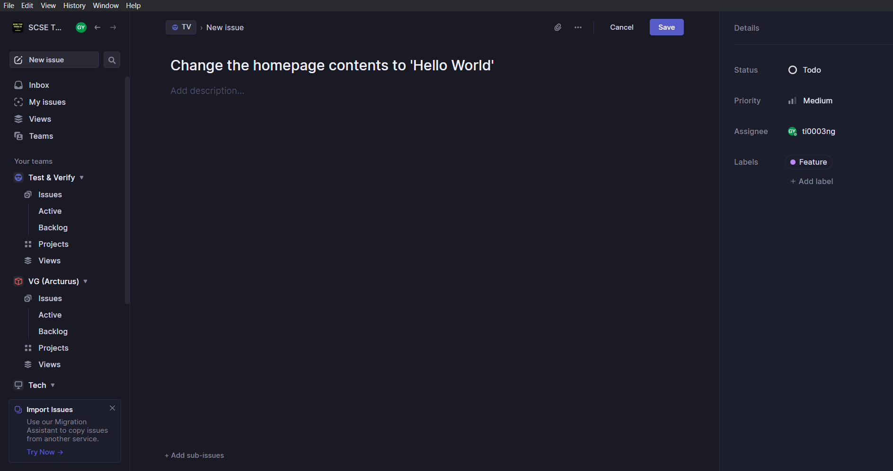
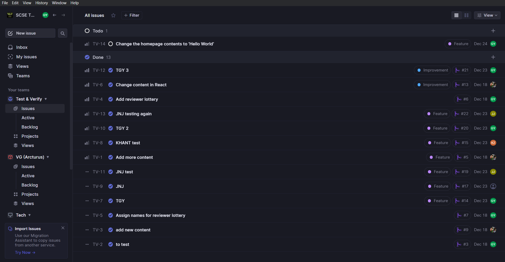

# The What and How of Linear Issue

This documentation contains the fundamentals of using Linear.

## Table of Contents
1. [Creating a Linear issue](#create-issue).
2. [Editing a Linear issue](#edit-issue).

## Creating a Linear issue 

1. Select your team. In our example, we will select 'Test & Verify' team.

2. Select 'Issues' tab.

3. Click on the '+' button on the top right and the issue creation window will be opened.

4. Now, key in the necessary information including title, description (if any), set the status, priority, assignee, label, as well as due date.

5. After that, save the issue and voila, a Linear issue is created.

   

      
   

## Editing a Linear issue 

1. From the list of issues, select the issue that you want to edit.

   

      
   

2. You can change the title, add description, change status, priority, assignee, label, as well as due date.

## References

Linear. (n.d.). *Create issues*. [https://linear.app/docs/creating-issues](https://linear.app/docs/creating-issues).

Linear. (n.d.). *Edit issues*. [https://linear.app/docs/editing-issues](https://linear.app/docs/editing-issues).